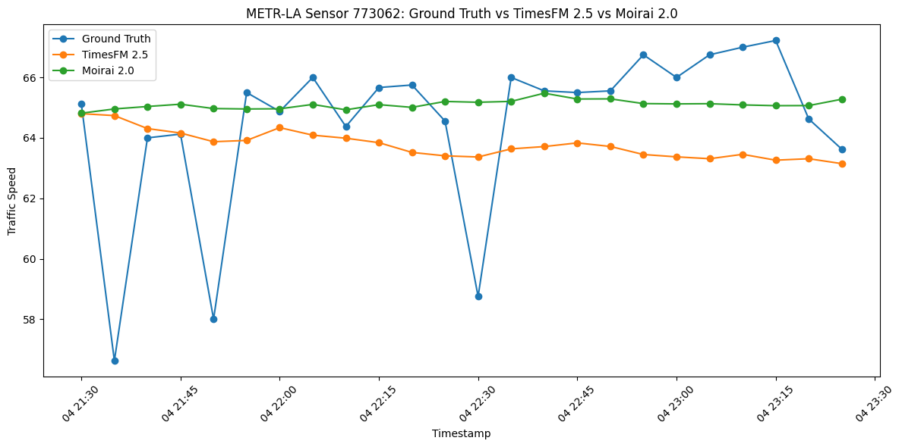
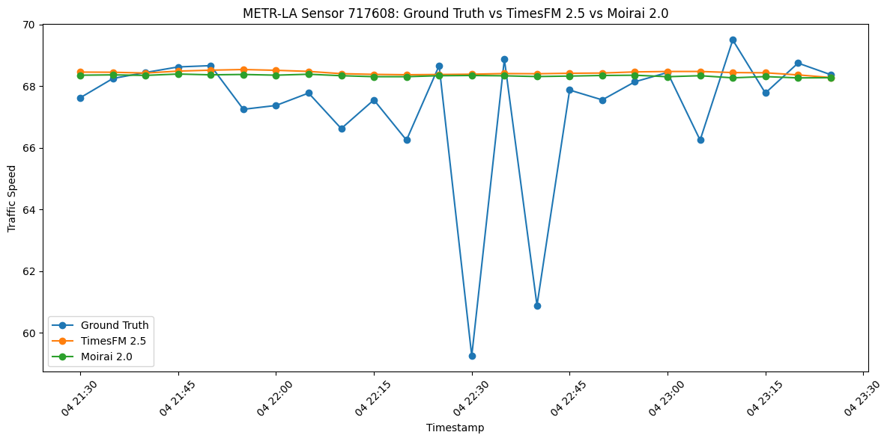

# UrbanVerse Urban Time-Series Foundation Model PoC

Zero-shot urban traffic forecasting with **TimesFM 2.5** and **Moirai 2.0** for the UrbanVerse temporal branch.

## Research objective

```text
Urban Time Series → Foundation Model → Temporal Urban Representation
```

This proof of concept tests two pretrained time-series foundation models on a real urban traffic series. The goal is to compare their zero-shot forecasts on the same input and show how a temporal-modeling backbone can later contribute to UrbanVerse.

## Experimental setup

| Item | Setting |
|---|---|
| Dataset | METR-LA |
| Urban variable | Traffic speed |
| Sampling interval | 5 minutes |
| Primary sensor | `773062` |
| Second sensor | `717608` |
| Context length | 96 observations = 8 hours |
| Forecast horizon | 24 observations = 2 hours |
| TimesFM checkpoint | `google/timesfm-2.5-200m-pytorch` |
| TimesFM package | `timesfm==2.0.2` |
| Moirai checkpoint | `Salesforce/moirai-2.0-R-small` |
| Moirai / Uni2TS package | `uni2ts==2.0.0` |
| Metrics | MAE, RMSE |
| Training / fine-tuning | None |

Both models receive the **same context, same ground truth, and same 24-step forecast horizon**.

## Main comparison — sensor `773062`

- Context: `2012-06-04 13:30` → `21:25`
- Forecast: `2012-06-04 21:30` → `23:25`
- 96 past observations → 24 future observations

| Model | MAE | RMSE |
|---|---:|---:|
| TimesFM 2.5 | 2.3031 | 2.9794 |
| Moirai 2.0 | **1.6552** | **2.7551** |



Moirai 2.0 produced the lower MAE and RMSE on this evaluation window.

**Outputs:** [comparison notebook](notebooks/03_model_comparison.ipynb) · [main-sensor results](results/main_sensor/)

## Zero-shot test — second sensor `717608`

The same pretrained models were applied to a second METR-LA traffic sensor with **no retraining or fine-tuning**.

| Model | MAE | RMSE |
|---|---:|---:|
| TimesFM 2.5 | 1.3665 | 2.5878 |
| Moirai 2.0 | **1.3389** | **2.5547** |



Both models transferred directly to the second sensor. The error difference is small, while the main generalization result is that both pretrained models can be reused on another urban time series without retraining.

**Outputs:** [second-sensor notebook](notebooks/04_second_sensor_zero_shot.ipynb) · [second-sensor results](results/second_sensor/)

## TimesFM vs. Moirai summary

| Model | Main sensor | Second sensor | Training on METR-LA |
|---|---|---|---|
| **TimesFM 2.5** | MAE 2.3031 / RMSE 2.9794 | MAE 1.3665 / RMSE 2.5878 | None |
| **Moirai 2.0** | MAE 1.6552 / RMSE 2.7551 | MAE 1.3389 / RMSE 2.5547 | None |

## UrbanVerse connection

```text
Urban Time Series
      ↓
TimesFM 2.5 / Moirai 2.0
      ↓
Temporal Representation
      ↓
Hourly Dynamics / Daily Dynamics / Longer-term Dynamics
      ↓
Multi-scale Urban Encoder
      ↓
Shared Latent City State
```

| Temporal scale | How the temporal branch can contribute |
|---|---|
| **Hourly dynamics** | Short traffic windows can represent recent changes over minutes and hours. The current 96-step context covers 8 hours at 5-minute resolution. |
| **Daily dynamics** | Temporal features from repeated windows can be combined to represent recurring within-day traffic patterns. |
| **Longer-term dynamics** | Features collected across longer contexts or multiple days can later be aggregated for slower-changing urban dynamics. |

In the full UrbanVerse architecture, these temporal features can later be combined with **Traffic + Mobility** and **Urban Graph + Knowledge** representations inside the **Multi-scale Urban Encoder** and contribute to the **Shared Latent City State**.

This PoC focuses on the working temporal forecasting component; full latent-representation fusion is future work.

## Notebook workflow

1. [`01_timesfm_inference.ipynb`](notebooks/01_timesfm_inference.ipynb) — TimesFM 2.5 zero-shot inference.
2. [`02_moirai2_inference.ipynb`](notebooks/02_moirai2_inference.ipynb) — Moirai 2.0 zero-shot inference on the same primary series.
3. [`03_model_comparison.ipynb`](notebooks/03_model_comparison.ipynb) — MAE/RMSE comparison and prediction visualization.
4. [`04_second_sensor_zero_shot.ipynb`](notebooks/04_second_sensor_zero_shot.ipynb) — second-sensor zero-shot test.

An additional [`05_robustness_test.ipynb`](notebooks/05_robustness_test.ipynb) is kept in the repository as optional follow-up analysis; it is not part of the core PoC scope described above.

## Repository structure

```text
urbanverse-timeseries-poc/
├── README.md
├── notebooks/
│   ├── 01_timesfm_inference.ipynb
│   ├── 02_moirai2_inference.ipynb
│   ├── 03_model_comparison.ipynb
│   ├── 04_second_sensor_zero_shot.ipynb
│   └── 05_robustness_test.ipynb   # optional follow-up
├── results/
│   ├── main_sensor/
│   └── second_sensor/
├── figures/
│   ├── main_sensor/
│   └── second_sensor/
├── data/
│   └── README.md
└── requirements*.txt
```

The main result CSVs and figures come from the executed notebooks. Additional optional analysis artifacts are kept in the repository but are not part of the main PoC presentation.

## Reproducibility

TimesFM and Moirai use separate compatible environments in this PoC.

- TimesFM 2.5 was validated on a Google Colab NVIDIA Tesla T4 runtime.
- Moirai 2.0 was validated with `uni2ts==2.0.0` and PyTorch 2.4.1 CPU in an isolated environment.
- All reported model runs are zero-shot on METR-LA.
- Raw METR-LA data and pretrained model weights are not committed to the repository.

See [`data/README.md`](data/README.md) and [`notebooks/README.md`](notebooks/README.md) for setup details.

## Status

- [x] Single urban variable selected: traffic speed
- [x] TimesFM inference completed
- [x] Moirai inference completed
- [x] Same input window and forecast horizon used
- [x] MAE / RMSE calculated for both models
- [x] Ground Truth / TimesFM / Moirai visualization produced
- [x] TimesFM vs. Moirai comparison table completed
- [x] Second-sensor zero-shot test completed
- [x] UrbanVerse temporal-role mapping documented
- [x] GitHub notebooks and README organized
