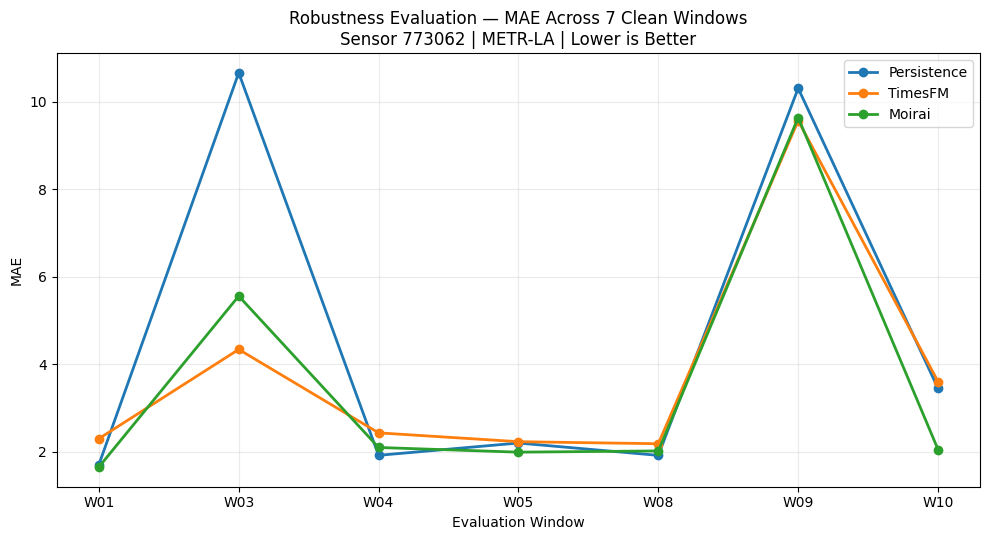
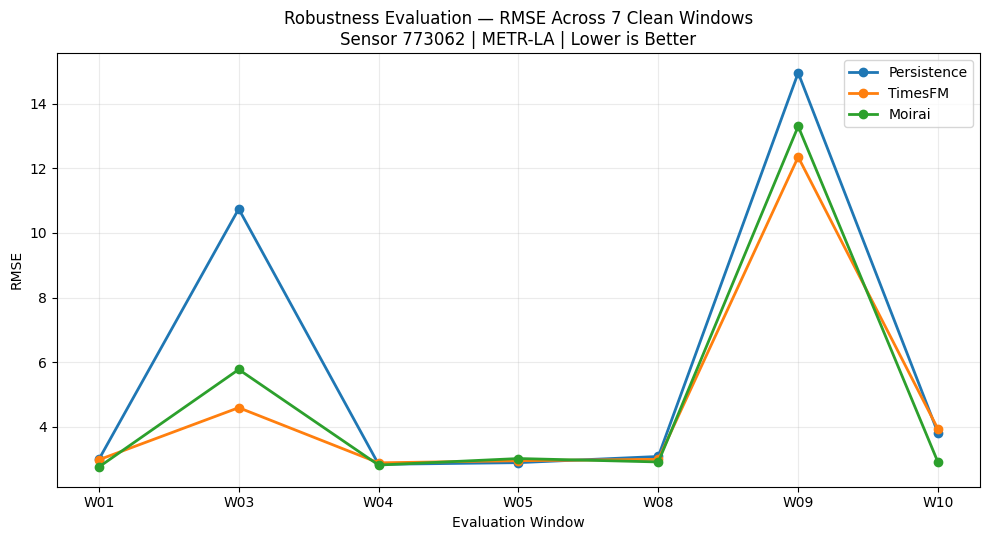
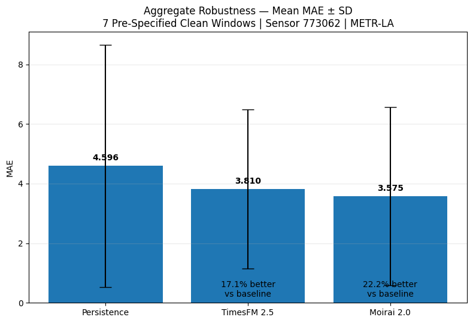
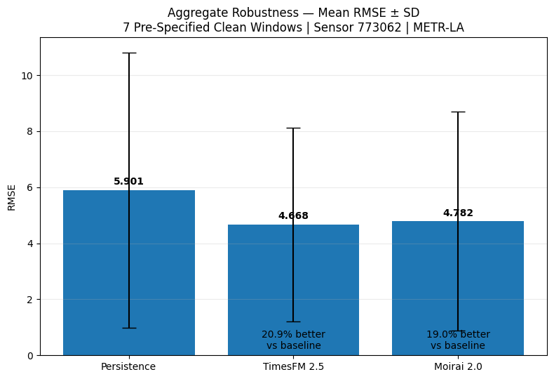
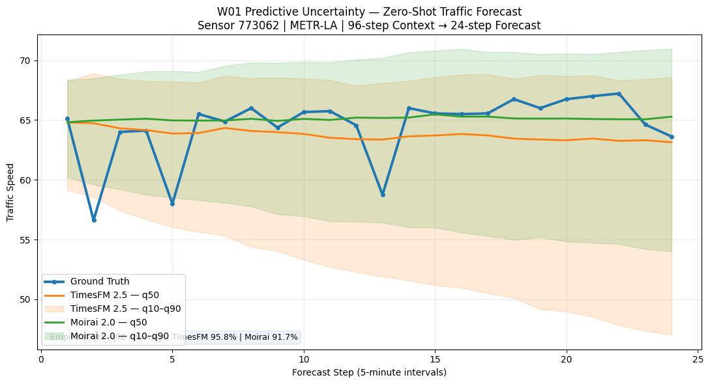
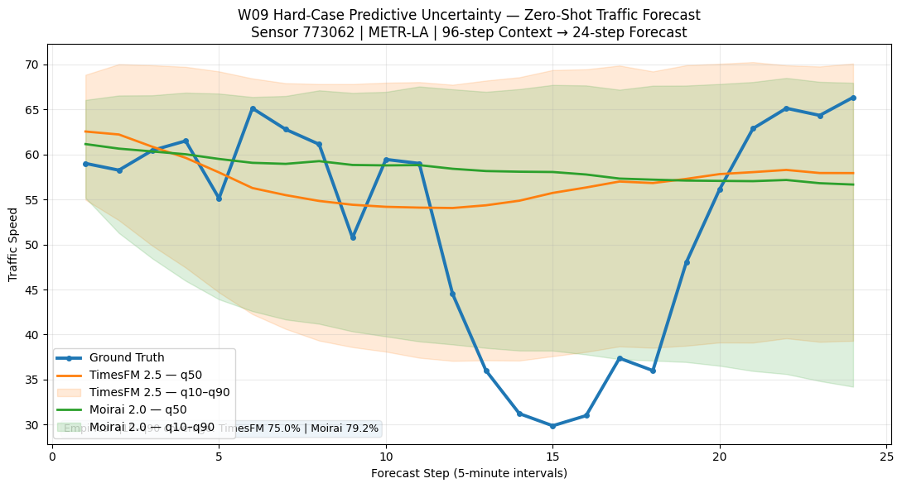

# UrbanVerse Urban Time-Series Foundation Model PoC

Zero-shot urban traffic forecasting with **TimesFM 2.5** and **Moirai 2.0** as candidate temporal-modeling backbones for the UrbanVerse research framework.

> **Source of truth:** the executed notebooks. The figures shown in this README are byte-identical extractions of the original `image/png` notebook outputs; they were not redrawn or replaced.

## Research objective

This proof of concept evaluates the UrbanVerse temporal branch:

```text
Urban Time Series → Foundation Model → Temporal Urban Representation
```

The PoC tests the **zero-shot forecasting behavior** of pretrained time-series foundation models on urban traffic speed, without training or fine-tuning on METR-LA. It does **not** claim to implement the complete UrbanVerse architecture or a finalized latent city representation.

## Experimental protocol

| Item | Setting |
|---|---|
| Dataset | METR-LA |
| Urban variable | Traffic speed |
| Sampling interval | 5 minutes |
| Primary sensor | `773062` |
| Zero-shot transfer sensor | `717608` |
| Context length | 96 observations = 8 hours |
| Forecast horizon | 24 observations = 2 hours |
| TimesFM checkpoint | `google/timesfm-2.5-200m-pytorch` |
| TimesFM Python package | `timesfm==2.0.2` |
| Moirai checkpoint | `Salesforce/moirai-2.0-R-small` |
| Moirai / Uni2TS package | `uni2ts==2.0.0` |
| Point forecast | q0.5 / median |
| Metrics | MAE, RMSE |
| Training / fine-tuning | None |

Both foundation models receive the **same context, same ground truth, and same 24-step forecast horizon**.

## Results at a glance

| Experiment | TimesFM 2.5 MAE | TimesFM 2.5 RMSE | Moirai 2.0 MAE | Moirai 2.0 RMSE |
|---|---:|---:|---:|---:|
| Primary sensor `773062` | 2.3031 | 2.9794 | **1.6552** | **2.7551** |
| Second sensor `717608` | 1.3665 | 2.5878 | **1.3389** | **2.5547** |

For robustness across the seven locked clean windows, **Moirai 2.0 has the lowest mean MAE (3.5748)**, while **TimesFM 2.5 has the lowest mean RMSE (4.6684)**. The experiment therefore does not identify a universal winner across all temporal regimes.

---

## 1. Main fixed-window comparison

Primary sensor: **`773062`**

- Context: `2012-06-04 13:30` → `21:25`
- Forecast: `2012-06-04 21:30` → `23:25`
- Context: 96 points
- Ground truth / forecast horizon: 24 points

| Model | MAE | RMSE |
|---|---:|---:|
| TimesFM 2.5 | 2.3031 | 2.9794 |
| Moirai 2.0 | **1.6552** | **2.7551** |


On this **specific fixed window**, Moirai 2.0 achieves lower MAE and RMSE. This is a window-level observation, not a claim of general model superiority.

**Traceable outputs:** [comparison notebook](notebooks/03_model_comparison.ipynb) · [main-sensor result files](results/main_sensor/)

---

## 2. Zero-shot transfer to a second sensor

The exact same pretrained models and evaluation protocol were applied to sensor **`717608`** with **no retraining or fine-tuning**.

| Model | MAE | RMSE |
|---|---:|---:|
| TimesFM 2.5 | 1.3665 | 2.5878 |
| Moirai 2.0 | **1.3389** | **2.5547** |


Both models transfer directly to the second traffic sensor. The performance difference between them is small on this window; the important PoC result is that both pretrained models can be applied zero-shot to another sensor without retraining.

**Traceable outputs:** [second-sensor notebook](notebooks/04_second_sensor_zero_shot.ipynb) · [second-sensor result files](results/second_sensor/)

---

## 3. Multi-window robustness evaluation

To reduce dependence on a single forecast window, **10 consecutive daily candidate windows were pre-specified** from `2012-06-04` through `2012-06-13`, all starting at `13:30`.

The data-quality rule was fixed before model inference:

- no NaN values
- no zero-valued measurements in context or forecast
- exact 5-minute timestamps
- 96 context + 24 forecast points

Seven windows passed the rule: `W01`, `W03`, `W04`, `W05`, `W08`, `W09`, `W10`.

Three were excluded only for data quality:

- `W02`: 9 zero values in context
- `W06`: 5 zero values in context
- `W07`: 26 zero values in context

No failed window was replaced based on model performance.

### Aggregate robustness results — 7 locked clean windows

| Model | Mean MAE | Std MAE | Median MAE | Mean RMSE | Std RMSE | Median RMSE |
|---|---:|---:|---:|---:|---:|---:|
| Persistence | 4.5957 | 4.0625 | 2.2031 | 5.9012 | 4.9121 | 3.0811 |
| TimesFM 2.5 | 3.8102 | 2.6685 | 2.4355 | **4.6684** | **3.4498** | 2.9927 |
| Moirai 2.0 | **3.5748** | 2.9928 | **2.0551** | 4.7823 | 3.9097 | **2.9119** |

Relative to persistence:

- TimesFM 2.5 improves mean MAE by **17.1%** and mean RMSE by **20.9%**.
- Moirai 2.0 improves mean MAE by **22.2%** and mean RMSE by **19.0%**.

### Per-window error behavior

<p align="center">
  
  
</p>

### Aggregate error — mean ± standard deviation

<p align="center">
  
  
</p>

The error bars above are **standard deviation across the seven clean windows**, not confidence intervals.

### Per-window wins

| Model | MAE wins | RMSE wins |
|---|---:|---:|
| Persistence | 2 / 7 | 1 / 7 |
| TimesFM 2.5 | 2 / 7 | 2 / 7 |
| Moirai 2.0 | 3 / 7 | 4 / 7 |

The robustness evaluation does not identify one universal winner: both pretrained models improve aggregate performance over persistence, while their relative performance varies across temporal windows.

**Traceable outputs:** [robustness notebook](notebooks/05_robustness_test.ipynb) · [robustness result files](results/robustness/)

---

## 4. Predictive uncertainty diagnostics

The executed robustness notebook also contains **q10–q50–q90** diagnostics for the main W01 window and an illustrative difficult W09 window.

### W01 — main evaluation window

| Model | q10–q90 empirical coverage | Mean interval width |
|---|---:|---:|
| TimesFM 2.5 | 23 / 24 = 95.8% | 15.9496 |
| Moirai 2.0 | 22 / 24 = 91.7% | 13.3498 |

### W09 — post-hoc illustrative hard window

| Model | q10–q90 empirical coverage | Mean interval width |
|---|---:|---:|
| TimesFM 2.5 | 18 / 24 = 75.0% | 28.0303 |
| Moirai 2.0 | 19 / 24 = 79.2% | 26.8294 |

<p align="center">
  
  
</p>

W09 is described as a hard/stress case **post hoc**, after inspecting the robustness errors; the original candidate-window schedule itself was pre-specified. The reported q10–q90 coverage is descriptive empirical coverage on these selected windows, **not a formal calibration or confidence guarantee**.

**Traceable outputs:** [robustness / uncertainty notebook](notebooks/05_robustness_test.ipynb) · [uncertainty result files](results/uncertainty/)

---

## UrbanVerse connection

```text
Urban Time Series
      ↓
TimesFM 2.5 / Moirai 2.0
      ↓
Temporal Representation
      ↓
Hourly Dynamics / Daily Dynamics / Longer-term Dynamics
      ↓
Multi-scale Urban Encoder
      ↓
Shared Latent City State
```

### How this temporal branch can contribute at different UrbanVerse scales

| UrbanVerse temporal layer | Potential contribution from TimesFM / Moirai |
|---|---|
| **Hourly dynamics** | Short-window representations can summarize recent intra-day traffic evolution and local changes over minutes to hours. The current 96-step context (8 hours at 5-minute resolution) directly demonstrates this short-horizon temporal modeling behavior. |
| **Daily dynamics** | Repeated temporal representations from windows across a day can be organized into daily traffic-pattern features, capturing recurring within-day structure before fusion with the other UrbanVerse modalities. |
| **Longer-term dynamics** | Temporal representations collected across multiple days or longer contexts can be aggregated into slower-changing temporal features for the multi-scale encoder. This is a future integration step; the current PoC does not claim to implement a long-horizon UrbanVerse representation layer. |

In the full UrbanVerse architecture, these multi-scale temporal features are intended to be combined with **Traffic + Mobility** and **Urban Graph + Knowledge** representations inside the **Multi-scale Urban Encoder**, contributing to a **Shared Latent City State**.

The current PoC validates **real zero-shot forecasting behavior for the temporal branch only**. It demonstrates that TimesFM and Moirai can take a real urban time series as input and produce real future-value predictions that can serve as evidence for choosing a temporal modeling backbone. The extraction and fusion of finalized UrbanVerse temporal latent representations are future work and are **not implemented in this PoC**.

## Notebook workflow

1. [`01_timesfm_inference.ipynb`](notebooks/01_timesfm_inference.ipynb) — TimesFM 2.5 zero-shot inference and validation.
2. [`02_moirai2_inference.ipynb`](notebooks/02_moirai2_inference.ipynb) — Moirai 2.0 zero-shot inference on the same primary-sensor experiment.
3. [`03_model_comparison.ipynb`](notebooks/03_model_comparison.ipynb) — same-window comparison, MAE/RMSE, and primary comparison plot.
4. [`04_second_sensor_zero_shot.ipynb`](notebooks/04_second_sensor_zero_shot.ipynb) — cleaned second-sensor zero-shot comparison.
5. [`05_robustness_test.ipynb`](notebooks/05_robustness_test.ipynb) — locked-window audit, persistence baseline, robustness evaluation, and uncertainty diagnostics.

## Repository structure

```text
urbanverse-timeseries-poc/
├── README.md
├── requirements.txt
├── requirements-common.txt
├── requirements-timesfm.txt
├── requirements-moirai2.txt
├── data/
│   └── README.md
├── notebooks/
│   ├── README.md
│   ├── 01_timesfm_inference.ipynb
│   ├── 02_moirai2_inference.ipynb
│   ├── 03_model_comparison.ipynb
│   ├── 04_second_sensor_zero_shot.ipynb
│   └── 05_robustness_test.ipynb
├── results/
│   ├── main_sensor/
│   ├── second_sensor/
│   ├── robustness/
│   └── uncertainty/
├── figures/
│   ├── main_sensor/
│   ├── second_sensor/
│   ├── robustness/
│   └── uncertainty/
├── scripts/
│   └── run_moirai2_robustness.py
└── src/
    ├── __init__.py
    ├── config.py
    ├── data_utils.py
    └── metrics.py
```

The CSV artifacts in `results/` correspond to outputs produced by the executed notebooks. The PNG files in `figures/` are direct extractions of the executed notebook outputs.

## Reproducibility notes

TimesFM and Moirai require different compatible environments in this PoC and are intentionally kept separate.

- TimesFM 2.5 was validated on a Google Colab NVIDIA Tesla T4 runtime.
- Moirai 2.0 was validated in an isolated environment with `uni2ts==2.0.0` and PyTorch 2.4.1 CPU.
- Model inference is zero-shot in all reported experiments.
- Inference speed is not compared because the validated pipelines use different devices/environments.
- Raw METR-LA data and pretrained model weights are not committed to the repository.

See [`data/README.md`](data/README.md) and [`notebooks/README.md`](notebooks/README.md) for the exact data-path and notebook provenance details.

## Status

- [x] Research scope defined
- [x] METR-LA dataset inspected
- [x] Primary sensor selected before model outputs
- [x] TimesFM 2.5 inference validated
- [x] Moirai 2.0 inference validated
- [x] Same-window MAE / RMSE comparison completed
- [x] Primary comparison plot produced
- [x] Second-sensor zero-shot transfer completed
- [x] Persistence baseline added
- [x] Multi-window robustness evaluation completed
- [x] Predictive uncertainty diagnostics completed
- [x] UrbanVerse hourly / daily / longer-term temporal-role mapping documented
- [x] Notebooks `01`–`05` organized in GitHub
- [x] Notebook-produced CSV outputs organized under `results/`
- [x] Notebook-native PNG outputs organized under `figures/`
- [x] Main README exposes the key experiment outputs and figures
