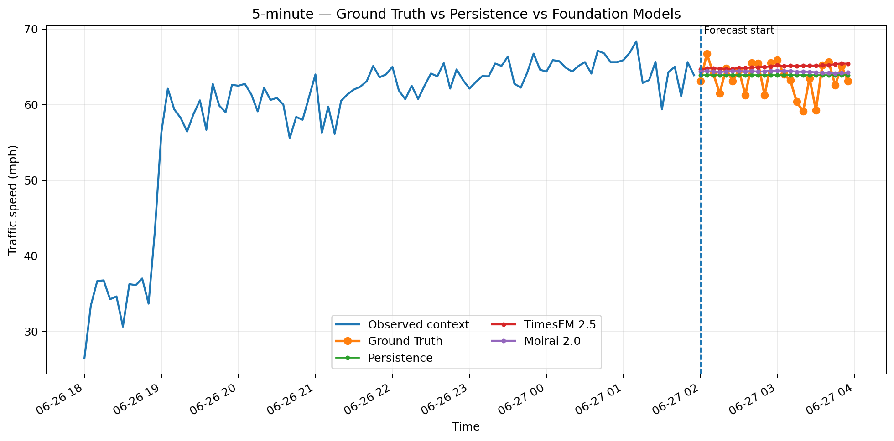
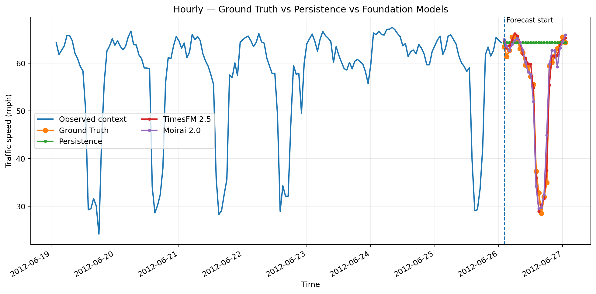
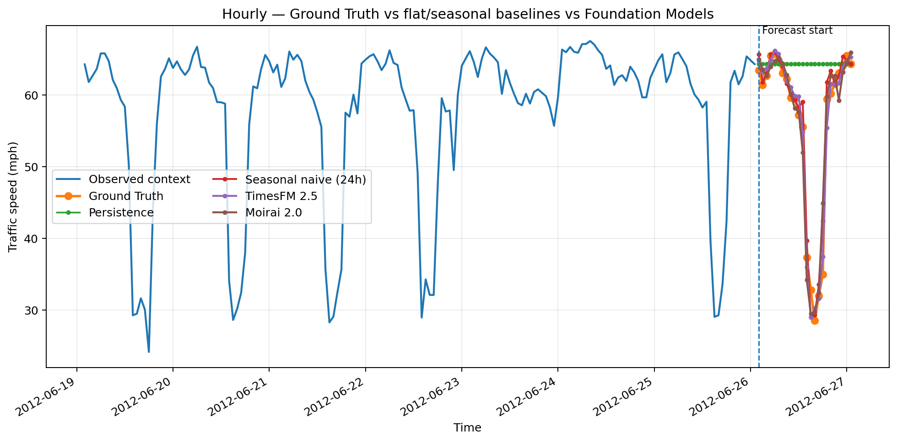
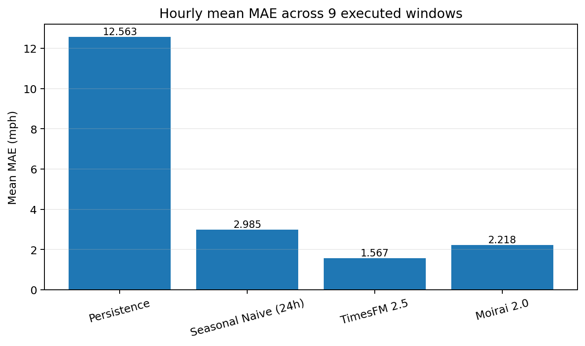
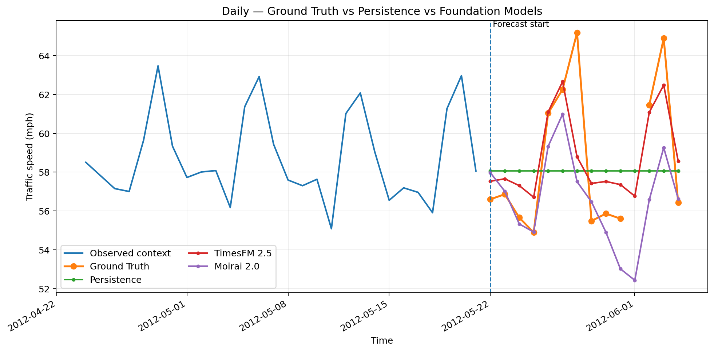
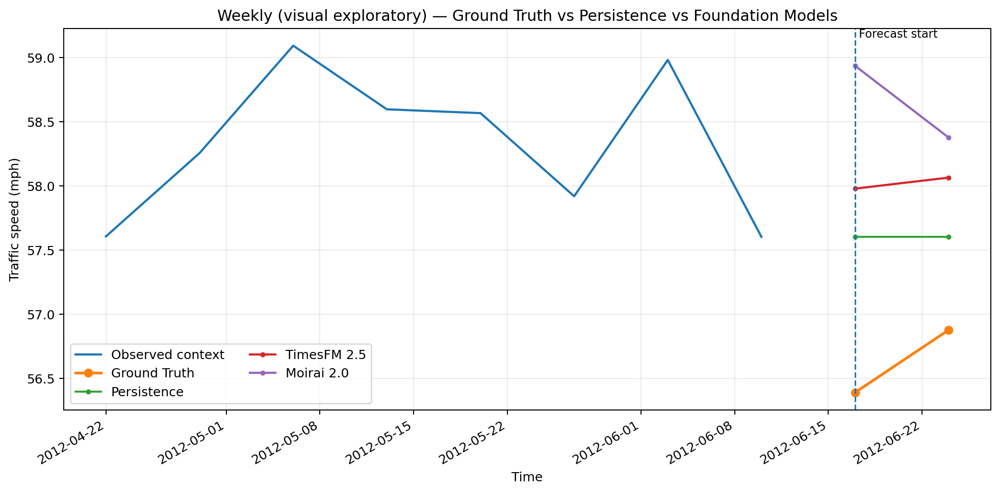
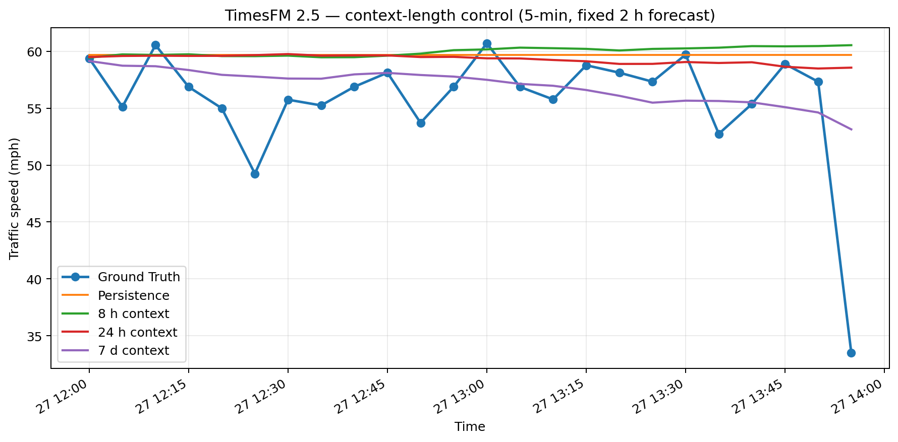
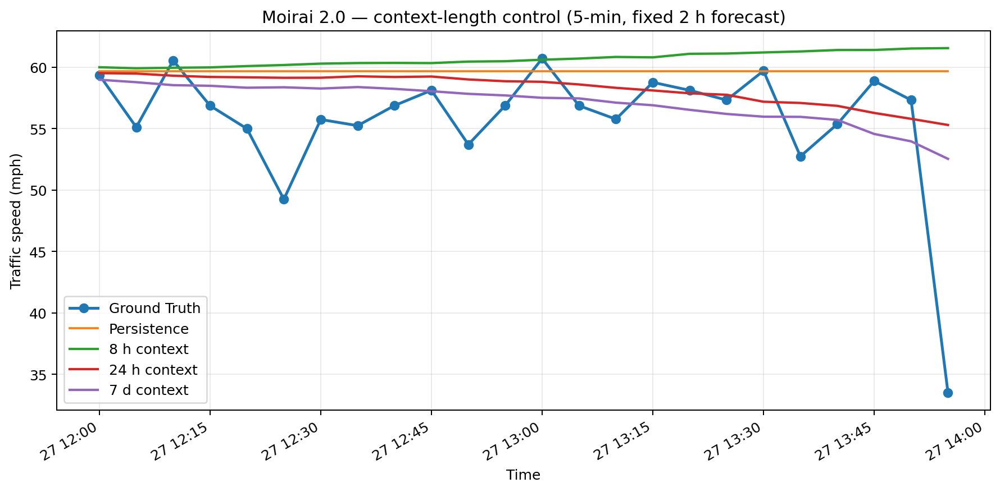

# UrbanVerse Urban Time-Series Foundation Model PoC

Zero-shot urban traffic forecasting with **TimesFM 2.5** and **Moirai 2.0** on **METR-LA** for the temporal branch of UrbanVerse.

```text
Urban Time Series -> Foundation Model -> Temporal Urban Representation
```

This repository is a **proof of concept**, not a full forecasting paper. The final revision focuses on five questions: are the metrics/alignment correct, do the models beat simple baselines, do point forecasts actually follow the trajectory, how does behavior change across time scales, and was the original 8-hour 5-minute context too short?

> **Figure policy:** only figures produced directly by the experiment/evaluation pipeline are used as scientific evidence. Manually redrawn summary figures are not used.

## Key findings

- **Hourly is the strongest executed scale.** Against **Seasonal Naive (24h)**, TimesFM has mean MAE `1.567` vs `2.985` and wins **8/9** windows. Moirai has mean MAE `2.218` and wins **4/9**.
- **Flat Persistence is structurally weak at a 24-hour horizon.** Seasonal Naive reduces mean MAE from `12.563` to `2.985`, so the hourly result should not be summarized only as “87% better than persistence.”
- **TimesFM's hourly advantage is more consistent than Moirai's.** Its largest gains occur where Seasonal Naive itself has the highest error; when the previous-day pattern is already captured well, the extra gain is much smaller.
- **Five-minute forecasts remain weak at step-to-step motion tracking.** Longer context helps, but even 7 days of 5-minute history does not fully resolve the high-frequency trajectory problem.
- **Sharp 5-minute movements are strongly under-reacted to.** A context-calibrated abrupt-change audit finds 19 q90 future events across 8/10 windows; both models predict only a small fraction of the observed change magnitude on these events.
- **The original 8-hour context was a real confound, but not the whole explanation.** Most of the observed gain appears once at least one full daily cycle is visible; additional history beyond 24 hours gives smaller/model-dependent gains.
- **Weekly is exploratory only** because the executed weekly forecast contains just two target points.

## Setup

| Item | Setting |
|---|---|
| Dataset | METR-LA |
| Primary sensor | `773062` |
| Original resolution | 5 minutes |
| TimesFM | `google/timesfm-2.5-200m-pytorch` |
| Moirai | `Salesforce/moirai-2.0-R-small` |
| Task-specific fine-tuning | None |
| Point forecast | median / q0.5 |

### Metric definitions

- **MAE (Mean Absolute Error):** average absolute distance between prediction and Ground Truth. Lower is better.
- **RMSE (Root Mean Squared Error):** error metric that penalizes larger misses more strongly because errors are squared before averaging. Lower is better.
- **First-difference correlation:** correlation between consecutive changes in Ground Truth and consecutive changes in the forecast. Higher positive values mean better movement tracking.
- **Directional accuracy:** fraction of consecutive steps where forecast and Ground Truth move in the same direction. `0.5` is roughly chance-level direction matching.
- **Variability ratio:** forecast change variability divided by Ground Truth change variability. Values near `1` indicate similar fluctuation magnitude; values near `0` indicate an overly smooth forecast.

The project therefore distinguishes **level tracking** (predicting approximately the right traffic-speed level) from **dynamics tracking** (following the short-term rises and falls).

## 1. Metric and alignment validation

The saved primary-window MAE/RMSE values were independently recomputed on the **raw traffic-speed scale**. Context ends at `2012-06-04 21:25`, Ground Truth begins at `21:30`, and no off-by-one error was found.

| Model | MAE | RMSE |
|---|---:|---:|
| TimesFM 2.5 | 2.3031 | 2.9794 |
| Moirai 2.0 | 1.6552 | 2.7551 |

The original single late-evening window is retained only as pilot provenance; the final interpretation relies on the multi-window experiments below.


### Additional zero-shot sensor check

The same pretrained checkpoints were also applied to sensor `717608` with no task-specific training or fine-tuning.

| Model | MAE | RMSE |
|---|---:|---:|
| TimesFM 2.5 | 1.3665 | 2.5878 |
| Moirai 2.0 | 1.3389 | 2.5547 |

This second sensor is a supporting transfer check, not the basis of the final ranking claim. The primary conclusions come from the multi-window experiments on sensor `773062`.

## 2. Multi-scale temporal dynamics

The observed series is resampled **before** inference at each scale. Five-minute forecasts are not averaged after prediction.

| Scale | Context | Horizon | Windows | Persistence MAE | TimesFM MAE | Moirai MAE |
|---|---:|---:|---:|---:|---:|---:|
| 5-minute | 8 h | 2 h | 10 | 4.225 | 3.464 | 3.453 |
| Hourly | 7 d | 24 h | 9 | 12.563 | **1.567** | 2.218 |
| Daily | 28 d | 14 d | 10 | 3.434 | **1.303** | 1.812 |
| Weekly | 8 wk | 2 wk | 1 | visual only | visual only | visual only |

Raw MAE should **not** be compared across scales as if they were the same forecasting task. The meaningful comparison is model vs baseline **within each scale**.

### 5-minute



Some forecast segments visibly move in the opposite direction from Ground Truth. This is an observed limitation rather than something hidden by the point-error metrics. In the controlled 5-minute experiment below, the 8-hour TimesFM forecast has first-difference correlation `-0.128` and directional accuracy `0.504`; Moirai has `0.107` and `0.496`. In other words, **the models can estimate traffic level better than they can follow every 5-minute rise and fall**.

Longer context improves this behavior but does not eliminate it: first-difference correlation rises to `0.240` for TimesFM and `0.229` for Moirai with 7 days of history. This is why the project reports trajectory metrics in addition to MAE/RMSE.

#### Sharp rise/drop audit

To test the visually sharp movements directly, abrupt events are defined using a threshold calibrated **only from the observed pre-forecast contexts**. The primary q90 threshold is `|Δ speed| >= 6.25` over one 5-minute step. Forecast-period Ground Truth and model error are **not** used to choose this threshold, which avoids selecting events after seeing model failures. A stricter q95 threshold (`8.125`) is saved as a sensitivity check.

The q90 rule identifies **19 future sharp events across 8 of the 10 executed 5-minute windows**.

| Model | Normal-step MAE | Sharp-event MAE | Direction accuracy on sharp events | Mean abs forecast change | Mean abs Ground Truth change | Mean amplitude ratio |
|---|---:|---:|---:|---:|---:|---:|
| TimesFM 2.5 | 3.051 | 8.270 | 0.684 | 0.257 | 10.628 | 0.025 |
| Moirai 2.0 | 3.101 | 7.538 | 0.526 | 0.446 | 10.628 | 0.039 |

The models therefore sometimes get the **direction** of a sharp move right, especially TimesFM, but they strongly under-estimate its **magnitude**. On q90 sharp events, TimesFM's mean absolute predicted change is only about `2.5%` of the observed change magnitude and Moirai's is about `3.9%`. The q95 sensitivity check gives the same qualitative conclusion. These are observed benchmark transitions; this audit does not claim whether any individual jump is a physical traffic incident or a sensor artifact.

### Hourly



At hourly resolution the trajectory result is much stronger: TimesFM reaches first-difference correlation `0.907` and directional accuracy `0.792`, while Moirai reaches `0.864` and `0.778`. The models can still disagree with Ground Truth at individual steps, but the overall rise/fall pattern is substantially better aligned than in the 5-minute case.

### Hourly with stronger baseline

**Seasonal Naive (24h)** copies each forecast hour from the same hour one day earlier.

| Method | Mean MAE | Mean RMSE | Wins vs Seasonal Naive | First-diff corr. | Directional accuracy | Variability ratio |
|---|---:|---:|---:|---:|---:|---:|
| Persistence | 12.563 | 17.274 | — | — | — | 0.000 |
| Seasonal Naive (24h) | 2.985 | 5.298 | baseline | 0.795 | 0.758 | 0.849 |
| **TimesFM 2.5** | **1.567** | **2.233** | **8/9** | **0.907** | **0.792** | **0.982** |
| Moirai 2.0 | 2.218 | 3.403 | 4/9 | 0.864 | 0.778 | 0.886 |

TimesFM has about **47.5% lower mean MAE** than Seasonal Naive. Moirai has about **25.7% lower mean MAE**, but its advantage is less consistent across windows. TimesFM's largest gains over Seasonal Naive occur in the hourly windows where the seasonal baseline itself has the highest error; when the previous-day pattern is already captured well, the additional gain is much smaller.

This remains a descriptive PoC result because the 9 hourly horizons overlap and are concentrated on 25–26 June 2012.





### Daily



### Weekly — exploratory only

Only two future points are available in the executed weekly window, so this figure is shown for completeness rather than model ranking.



## 3. Context-length control at fixed 5-minute resolution

The forecast origin, 5-minute resolution, and 24-step / 2-hour target are held fixed while only the history length changes.

| Model | Context | Mean MAE | First-diff corr. | Directional accuracy | Variability ratio |
|---|---:|---:|---:|---:|---:|
| TimesFM | 8 h | 3.385 | -0.128 | 0.504 | 0.058 |
| TimesFM | 24 h | 2.913 | 0.103 | **0.558** | **0.503** |
| TimesFM | 7 d | **2.560** | **0.240** | 0.549 | 0.302 |
| Moirai | 8 h | 3.137 | 0.107 | 0.496 | 0.423 |
| Moirai | 24 h | **2.412** | 0.176 | **0.540** | **0.509** |
| Moirai | 7 d | 2.461 | **0.229** | 0.531 | 0.396 |

For TimesFM, mean MAE falls by about **24.4%** from 8 hours to 7 days. For Moirai, the best MAE occurs at **24 hours**; 7 days does not improve it further. The largest improvement generally appears once at least one full daily cycle is visible, but longer history does not fully solve high-frequency step-to-step tracking.

The paired quality filter leaves **5 origins**, one from each clock-time regime, but all five are from **2012-06-27**. This control is therefore descriptive and single-day.





## Interpretation

The final PoC does not support a blanket “foundation models are better” statement. A more defensible result is:

> **TimesFM shows consistent added value at the executed hourly scale, including against a strong previous-day seasonal baseline. Moirai's hourly advantage is more window-dependent. At 5-minute resolution, longer historical context improves error and some shape diagnostics, but does not fully solve high-frequency trajectory tracking. The event-conditioned audit confirms that both models strongly under-react to the largest observed 5-minute changes.**

The visually opposite short-term movements in some 5-minute segments are therefore consistent with the measured trajectory weakness; they should not be interpreted as evidence that MAE/RMSE alone proves good dynamics tracking.

The remaining 5-minute vs hourly gap is consistent with a role for temporal aggregation/resolution, but this experiment does not isolate that factor causally because resolution, history duration, and target duration differ across the multi-scale setups.

## Reproducibility

- Saved predictions and evaluation outputs are committed under `results/`.
- Scientific evaluation utilities are under `src/`.
- Experiment/evaluation scripts are under `scripts/`.
- The context-calibrated sharp-event audit is reproducible with `scripts/run_5min_sharp_event_analysis.py`; its summary, q90 event details, and protocol are committed under `results/sharp_events/`; the script also regenerates the diagnostic figure locally.
- Raw `metr-la.h5` and pretrained checkpoints are intentionally not committed.

## Limitations

- Primary final experiments use one METR-LA sensor (`773062`); sensor `717608` is only a supporting zero-shot transfer check.
- Five-minute and hourly executed windows are weekday-only.
- Hourly horizons overlap and are concentrated on two days.
- The paired context ablation uses five regimes from a single day after data-quality filtering.
- Weekly results are visual/exploratory because only two future points are available.
- Cross-scale comparisons are descriptive because the forecasting tasks are not identical across resolutions.
- Sharp-event labels identify unusually large observed benchmark transitions; they do not establish whether a jump is a real traffic incident, sensor noise, or another data-generation effect.
- Results are descriptive; no statistical-significance/generalization claim is made.

## Sources

- **METR-LA / DCRNN data pipeline:** https://github.com/liyaguang/DCRNN
- **TimesFM 2.5 model card:** https://huggingface.co/google/timesfm-2.5-200m-pytorch
- **TimesFM paper:** https://arxiv.org/abs/2310.10688
- **Moirai 2.0 model card:** https://huggingface.co/Salesforce/moirai-2.0-R-small
- **Moirai / Uni2TS implementation:** https://github.com/SalesforceAIResearch/uni2ts
- **Moirai paper:** https://arxiv.org/abs/2402.02592
